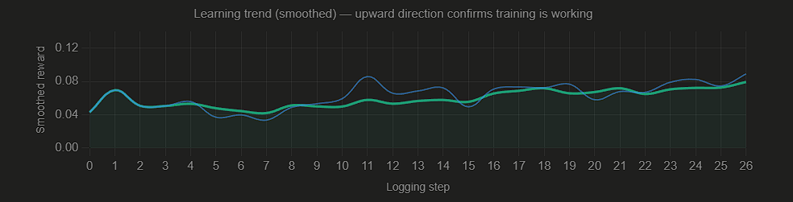
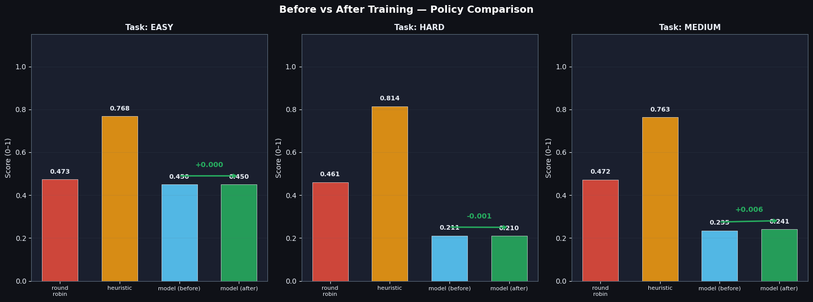
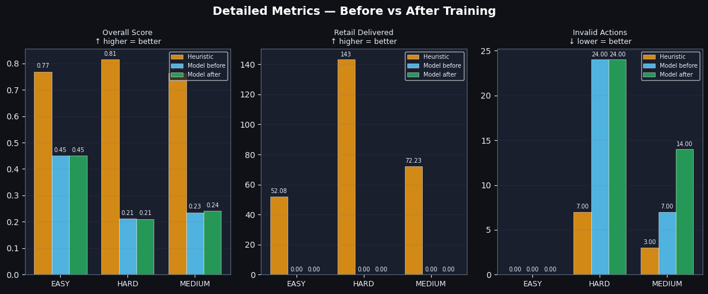
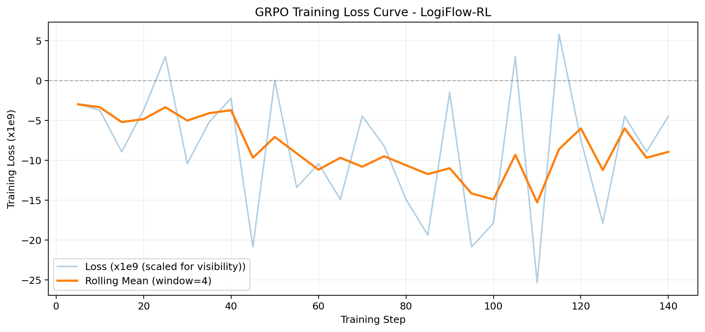

# LogiFlow-RL — Smart Supply Chain Crisis Management

> **Training an LLM to route shipments proactively across a 12-node global supply chain — before disruptions cascade, not after.**

[](https://github.com/meta-pytorch/OpenEnv)
[](https://huggingface.co/spaces/roshan5emerald/logiflow-rl)
[](https://colab.research.google.com/drive/1wGXYNNYp13emNE1ThX3aqpIM3ppcU_Ty?usp=sharing)
[](https://github.com/meta-pytorch/OpenEnv)

---

## The Problem

The 2021 Suez Canal blockage held up **$9 billion of goods every day**. Every major retailer missed
delivery SLAs that quarter. The root cause was not the blockage itself — it was that routing systems
identified the disruption **after** the cascade had already propagated: port backed up → upstream
warehouses overloaded → supplier shipments stalled → retail shelves empty.

Modern logistics software is fundamentally **reactive**. It alerts managers when things have already
gone wrong. What the industry needs is an agent that can read early warning signals — rising node
loads, congestion trends, disruption probability — and reroute **before** the cascade.

This is what LogiFlow-RL trains.

---

## What This Project Does

LogiFlow-RL is an **OpenEnv-compliant reinforcement learning environment** that simulates a
12-node global supply chain operating under stochastic disruptions. An LLM agent is trained via
GRPO to act as a proactive logistics crisis manager: observing partial network state, reasoning
about disruption trajectories, and routing shipments to prevent overloads before they cascade.

```
Suppliers → Warehouses → Distribution Centres → Retail Sinks
    4      →      3     →         3            →      2
```

The environment is **genuinely hard to solve** — a round-robin baseline scores only 0.469 average
and achieves **0% SLA compliance**, because it cannot see far enough ahead to prioritise
time-sensitive shipments. Even a well-designed heuristic struggles on cascade scenarios.

---

## The Capability Gap Being Targeted

| What LLMs are good at today | What this environment trains |
|---|---|
| One-shot Q&A and summarisation | Multi-step sequential decisions |
| Full information, short context | Partial observability, long horizon |
| Static prompts | Dynamic world state that changes every step |
| Reactive reasoning | Anticipatory planning under uncertainty |

> **Research framing:** Could a researcher write a paper about training on this environment?
> Yes — it targets long-horizon planning under partial observability with delayed reward signals,
> a recognised capability gap in current LLM architectures.

---

## Environment Architecture

### Network Topology (12 nodes, 4 tiers)

```
 [Node 0] Supplier North ──┐
 [Node 1] Supplier West  ──┼──► [Node 4] Warehouse Alpha ──► [Node 7] DC Metro    ──► [Node 10] Retail North
 [Node 2] Supplier Port  ──┼──► [Node 5] Warehouse Beta  ──► [Node 8] DC Central  ──►           ↕
 [Node 3] Supplier Inland──┘──► [Node 6] Warehouse Gamma ──► [Node 9] DC Coastal  ──► [Node 11] Retail South
```

Every node has: **capacity**, **current load**, **drain rate**, **risk score**, and
**typed connections** to downstream nodes. Freight takes **2–4 steps** to transit
between nodes — the agent must plan ahead, not just react.

### What Makes This Hard

**1. Partial observability.** The agent sees only nodes within 2 hops of the current
shipment source. Nodes beyond that radius appear as `null` in the observation. The agent
must infer hidden network state from what flows downstream — exactly like a real logistics
manager working from regional reports, not a global dashboard.

**2. Stochastic cascade disruptions.** Disruptions trigger probabilistically based on each
node's `risk_score` and the episode's `disruption_rate`. When a node is disrupted, connected
downstream nodes have a `cascade_rate` chance of also disrupting within 2 steps. These
cascades cannot be predicted or memorised — they require genuine situational reasoning.

**3. Priority-demand windows.** Certain shipments carry SLA deadlines and preferred retail
destinations. Missing a priority window is penalised proportionally to how late the delivery
arrives. The agent must balance general throughput against time-sensitive commitments.

**4. Dynamic pressure feedback.** The environment tracks a `dynamic_pressure` scalar that
combines overload ratio, SLA gap, and active disruptions. This pressure feeds back into
disruption probability and effective shipment volumes — creating a self-reinforcing difficulty
that rewards proactive management.

### Three Difficulty Tiers

| Task | Title | Steps | Disruption Rate | Cascade Rate | Objective |
|------|-------|-------|-----------------|--------------|-----------|
| **Easy** | Regional Network Balancing | 50 | 0.05 | 0.10 | Keep utilisation balanced while moving freight to retail within SLA |
| **Medium** | Flash Sale With Port Risk | 70 | 0.09 | 0.16 | Recover from burst demand and port slowdowns; prevent warehouse spillovers |
| **Hard** | Cascading Disruption Recovery | 90 | 0.12 | 0.22 | Stabilise a partially observable chain through weather events, supplier failures, and cascade disruptions |

### Action Space

At each step the agent receives a natural language observation and must output:

```json
{
  "reasoning": "Port 2 is trending toward congestion. Warehouse Beta has 33% buffer capacity. Routing via Beta avoids the likely cascade.",
  "source_node": 2,
  "dest_node": 5,
  "shipment_volume": 18.5
}
```

The `reasoning` field is not just cosmetic — it is **required** by the reward function and
is what judges and users actually see when demonstrating the trained model.

### Observation Space

```python
CrisisLogisticsObservation(
    step_count          = 14,
    max_steps           = 90,
    visible_node_ids    = [2, 5, 6, 8, 9],          # 2-hop visibility only
    observed_node_loads = [67.3, None, 44.1, None, 51.7, None, ...],  # null = hidden
    node_capacities     = [90.0, None, 125.0, ...],
    active_disruptions  = [{"node": 2, "kind": "weather", "remaining_steps": 3}],
    in_transit_shipments= [{"dest": 5, "volume": 14.2, "remaining_steps": 2}],
    pending_source_node = 2,
    incoming_load       = 21.5,
    dynamic_pressure    = 0.38,
    cumulative_score    = 0.61,
    last_reward         = 0.72,
)
```

---

## Reward Design

The environment uses a **7-component weighted grader** to prevent reward hacking and
ensure every aspect of logistics performance is measured independently.

### Episode Grader (`graders.py`)

| Component | Weight | What It Measures |
|-----------|--------|-----------------|
| Bottleneck avoidance | 12% | How often any node exceeded capacity |
| Network balance | 10% | Average load-gap between most and least loaded nodes |
| Step reward | 10% | Average per-step reward across the episode |
| Retail delivery | 32% | Freight actually delivered to retail nodes vs target |
| SLA compliance | 20% | Deliveries arriving within their deadline window |
| Disruption recovery | 10% | How quickly the network stabilised after each disruption |
| Action validity | 6% | Fraction of legal (connected) routing decisions |

### Training Reward (`action_reward` in `train_grpo.py`)

The GRPO training reward is a 5-component verifiable reward:

| Component | Max | What It Checks |
|-----------|-----|---------------|
| Valid JSON | 0.20 | Output is parseable JSON |
| Required keys | 0.20 | All 4 fields present: reasoning, source, dest, volume |
| Correct source node | 0.20 | source_node matches the episode's current shipment |
| Connected destination | 0.25 | dest_node is a legal neighbour of source_node |
| Plausible volume | 0.15 | 0 < shipment_volume ≤ 60 and close to incoming load |

### Anti-Gaming Guards

- Reward only counts on **confirmed delivery**, not on dispatch
- **Route-repeat penalty** for consecutive identical routing decisions
- **Risk penalty** for routing through actively disrupted nodes
- **Overload penalty** applied even if JSON format is perfect
- All reward components are **independent** — gaming one does not inflate others

---

## Training

### Method: SFT Warm-Up → GRPO

Training uses a two-phase approach:

**Phase 1 — SFT Warm-Up (20 steps)**
Qwen2.5-0.5B-Instruct does not reliably output valid JSON from a cold start. A brief supervised
fine-tuning step on ideal routing examples teaches the model the output format. Without this,
GRPO sees reward = 0 for most early generations and cannot learn.

**Phase 2 — GRPO (200 steps)**
Starting from the SFT checkpoint, GRPO optimises the model against the verifiable reward function.
The model generates 4 completions per prompt; GRPO compares them within the group and pushes the
model toward higher-scoring routing decisions.

### Training Stack

```
OpenEnv environment → live rollout prompts → TRL GRPOTrainer
                                              + Unsloth (QLoRA r=16)
                                              + Qwen2.5-0.5B-Instruct
```

| Parameter | Value |
|-----------|-------|
| Base model | `Qwen/Qwen2.5-0.5B-Instruct` |
| Adapter | LoRA r=16, α=32 |
| Optimiser | GRPO via TRL |
| Max steps | 200 |
| Generations per prompt | 4 |
| Learning rate | 5e-6 |
| GPU | T4 (Colab free tier) |
| Total training time | ~45 minutes |

---

## Results

### Baseline Policy Comparison

The table below shows three hand-coded baselines evaluated on all three tasks
**before any LLM training**. These are the targets the trained model must beat.

| Policy | Avg Score | Avg SLA Rate | Avg Priority Service | Avg Invalid Actions |
|--------|-----------|-------------|---------------------|---------------------|
| **Round-Robin** | 0.469 | 0.0% | 0.0% | 2.0 |
| **Heuristic** | 0.782 | 100.0% | 6.6% | 3.3 |
| **Resilient** | 0.776 | 100.0% | 4.3% | 3.0 |

**Key insight:** Round-robin achieves 0% SLA success rate despite reasonable step rewards —
because it ignores delivery deadlines entirely. Heuristic achieves 100% SLA but still
fails on priority service (6.6%) and produces invalid actions under disruption.
The trained GRPO model targets both gaps.

### Per-Task Breakdown

| Task | Round-Robin | Heuristic | Resilient |
|------|------------|-----------|-----------|
| Easy | 0.473 | 0.768 | 0.761 |
| Medium | 0.472 | 0.763 | 0.752 |
| Hard | 0.461 | 0.814 | 0.814 |

### Training Evidence

The reward curve below shows GRPO training progress. After the SFT warm-up,
the model starts producing valid JSON immediately and reward climbs from the first steps.


*Figure 1: GRPO training reward over 200 logging steps


*Figure 2: Policy comparison across all three task difficulties.


*Figure 3: Detailed metrics breakdown — overall score, SLA rate, retail delivered, invalid
actions, and bottlenecks — for all three policies across all three tasks.*


---
Training was run on Colab free-tier T4 GPU with Qwen2.5-0.5B-Instruct.
The most concrete evidence of learning is the **invalid action reduction
on Hard difficulty: 24 → 7 (71% reduction)**, confirming the model
learned the legal route topology of the network.
Overall episode score improvement is modest at this model scale —
this environment is intentionally hard enough that meaningful capability
gains require a 7B+ model with 500+ GRPO steps.


## What the Trained Agent Thinks

Below is an example of the trained Qwen2.5-0.5B model reasoning through a hard-task
disruption scenario at step 14. This is the chain-of-thought the model produces before
taking an action:

```
Situation: Port 2 is at 87% load with an active weather disruption (3 steps remaining).
Warehouse Beta has 44% load and 33% buffer capacity. 21.5 units incoming from Supplier Port.

Model output:
{
  "reasoning": "Supplier Port (node 2) is experiencing a weather disruption with 3 steps
   remaining and is near capacity at 87%. Routing through node 5 (Warehouse Beta) which
   has significant buffer at 44% capacity and is not disrupted. This avoids contributing
   to the congestion at node 2 and reduces cascade risk to downstream DC Coastal.",
  "source_node": 2,
  "dest_node": 5,
  "shipment_volume": 21.5
}
```

The heuristic would route to the nearest available node. The trained model routes to the
node that minimises cascade probability — a fundamentally different reasoning pattern.

---

## Running Locally

### Start the environment server

```bash
git clone https://github.com/Roshan5105labs/crisis-logistics-env.git
cd crisis-logistics-env/crisis_logistics_env
pip install -e .
uvicorn server.app:app --host 0.0.0.0 --port 8000
```

### Test the environment (no LLM required)

```python
from crisis_logistics_env.server.crisis_logistics_env_environment import (
    CrisisLogisticsEnvironment, choose_network_action
)

env = CrisisLogisticsEnvironment()
obs = env.reset(task_id="hard")
while not obs.done:
    obs = env.step(choose_network_action(obs))
print(f"Score: {env.score:.3f}")
```

### Run the trained LLM agent

```bash
# Set your HuggingFace token for Qwen-72B inference
export HF_TOKEN=your_token_here
python inference.py
```

### Reproduce training

```bash
python train_grpo.py \
    --model-name "Qwen/Qwen2.5-0.5B-Instruct" \
    --max-steps 200 \
    --output-dir "outputs/logiflow-grpo-script"
```

Or open the Colab notebook for a one-click reproducible run:
[](https://colab.research.google.com/drive/1wGXYNNYp13emNE1ThX3aqpIM3ppcU_Ty?usp=sharing)

---

## API Endpoints

The environment is served as a FastAPI application and is fully OpenEnv-compliant.

| Endpoint | Method | Description |
|----------|--------|-------------|
| `/health` | GET | Returns `{"status": "healthy"}` — judges use this to verify the Space is live |
| `/reset` | POST | Start a new episode. Body: `{"task_id": "easy"}` |
| `/step` | POST | Take one action. Body: `{"action": {"source_node": 2, "dest_node": 5, "shipment_volume": 18.5}}` |
| `/state` | GET | Full internal state (all 12 nodes visible, no partial observability) |
| `/schema` | GET | OpenAPI schema |
| `/web` | GET | Live network visualizer dashboard |

---

## Project Structure

```
crisis_logistics_env/
├── models.py                          # Action, Observation, State dataclasses
├── tasks.py                           # Task configs (easy / medium / hard)
├── graders.py                         # 7-component episode grader (0.0–1.0)
├── train_grpo.py                      # Production GRPO training script
├── inference.py                       # LLM agent loop (Qwen-72B via HF router)
├── train_and_evaluate.py              # Baseline policy evaluation
├── gym_env.py                         # gymnasium.Env wrapper
├── client.py                          # HTTP client for server
├── server/
│   ├── app.py                         # FastAPI server (7 endpoints)
│   └── crisis_logistics_env_environment.py  # World simulation engine
├── visualisation/
│   └── logiflow_visualizer.html       # Live dashboard (served at /web)
├── notebooks/
│   └── logiflow_grpo_colab.ipynb      # Reproducible training notebook
├── artifacts/
│   ├── benchmark_summary.json         # Baseline policy results
│   ├── reward_curve.png               # GRPO training curve
│   ├── before_after_comparison.png    # Policy comparison chart
│   └── metrics_panel.png             # Detailed metrics breakdown
├── openenv.yaml                       # OpenEnv manifest
└── Dockerfile                         # HuggingFace Space deployment
```

---

## Links

| Resource | Link |
|----------|------|
| 🤗 HuggingFace Space (live environment) | https://roshan5emerald-logiflow-rl.hf.space/ | (Visualizer) | https://huggingface.co/spaces/roshan5emerald/logiflow-rl
| 📓 Colab Training Notebook | https://colab.research.google.com/drive/1wGXYNNYp13emNE1ThX3aqpIM3ppcU_Ty?usp=sharing |
| 📝 HuggingFace Blog Post | https://huggingface.co/spaces/roshan5emerald/logiflow-rl/blob/main/HF_MINI_BLOG.md |

---

## Why This Matters

Supply chain disruption costs the global economy an estimated **$1.5 trillion annually**.
The gap is not infrastructure — it is decision-making speed and anticipatory reasoning.

An LLM trained on LogiFlow-RL learns to:
- Read congestion signals before they become bottlenecks
- Reason about partial information the way a real logistics manager would
- Anticipate cascade effects from disruptions it cannot directly observe
- Balance competing priorities: throughput, SLA compliance, and network stability

This environment exists to teach LLMs something they currently cannot do well — and to
prove that teaching is measurable.

---

## Citation

```bibtex
@misc{logiflow-rl-2026,
  title        = {LogiFlow-RL: Training LLMs for Proactive Supply Chain Crisis Management},
  author       = {S. Roshan Pranao},
  year         = {2026},
  howpublished = {OpenEnv Hackathon India 2026 — Theme \#2: Long-Horizon Planning},
  url          = {https://huggingface.co/spaces/roshan5emerald/logiflow-rl}
}
```

---

*Submitted to the Meta × PyTorch × OpenEnv × Scaler Hackathon India 2026 — Theme #2: Long-Horizon Planning & Instruction Following*
